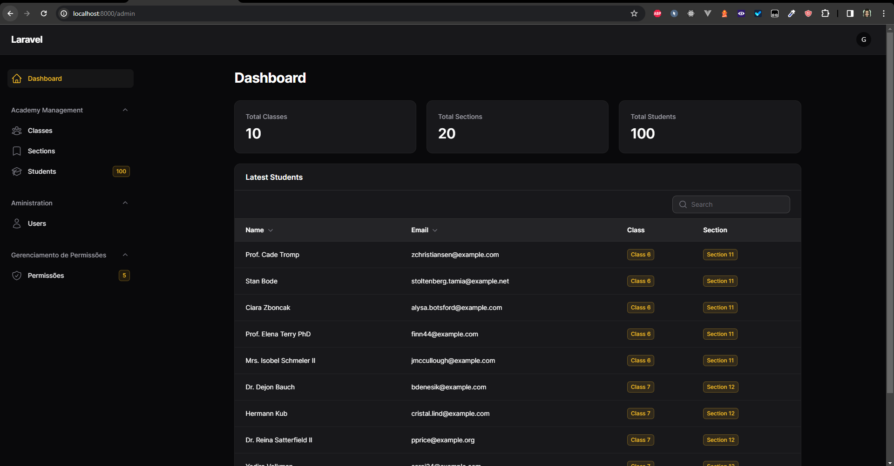

# Projeto de Administração Escolar com Filament Shield

Este projeto é uma aplicação de administração escolar desenvolvida com o [Filament Shield](https://github.com/bezhanSalleh/filament-shield), uma ferramenta poderosa para gerenciar permissões em aplicações Laravel Filament.

## Sobre o Projeto

Este sistema de administração escolar permite uma gestão eficiente de usuários com diferentes níveis de acesso: `super_user` (diretor), `professor` e `aluno`, cada um com permissões específicas. O objetivo é facilitar a administração de recursos e atividades escolares de forma segura e organizada.

## Funcionalidades

- **Gestão de Usuários:** Criação e gerenciamento de usuários com diferentes roles: diretor, professor e aluno.
- **Controle de Acesso:** Permissões detalhadas para cada role, garantindo acesso apropriado a recursos e informações.
- **Documentação Detalhada:** Tradução e detalhamento da documentação do Filament Shield para ajudar na implementação e compreensão do sistema.

## Como Usar

1. **Clone o Repositório**
   
```bash
git clone https://github.com/gabrielestefono/curso_filament_shield.git
```

```bash
cd curso_filament_shield
```

2. **Instale as Dependências**

```bash
composer install
```

3. **Configure o Ambiente**

   Copie o arquivo `.env.example` para `.env` e configure as variáveis de ambiente necessárias.

4. **Rode as Migrações**

```bash
php artisan migrate
```

5. **Inicie o Projeto**

```bash
php artisan serve
```

## Documentação

Para aprender mais sobre como usar e modificar este sistema de administração escolar, confira a pasta `Docs` na raiz do projeto. Ela contém a documentação traduzida e detalhada do Filament Shield, além de guias específicos para este projeto.

## Projeto Base

Dentro da pasta `ProjetoBase`, você encontrará um projeto base configurado para que você possa seguir a documentação e implementar suas próprias funcionalidades.

O projeto ficará assim:
